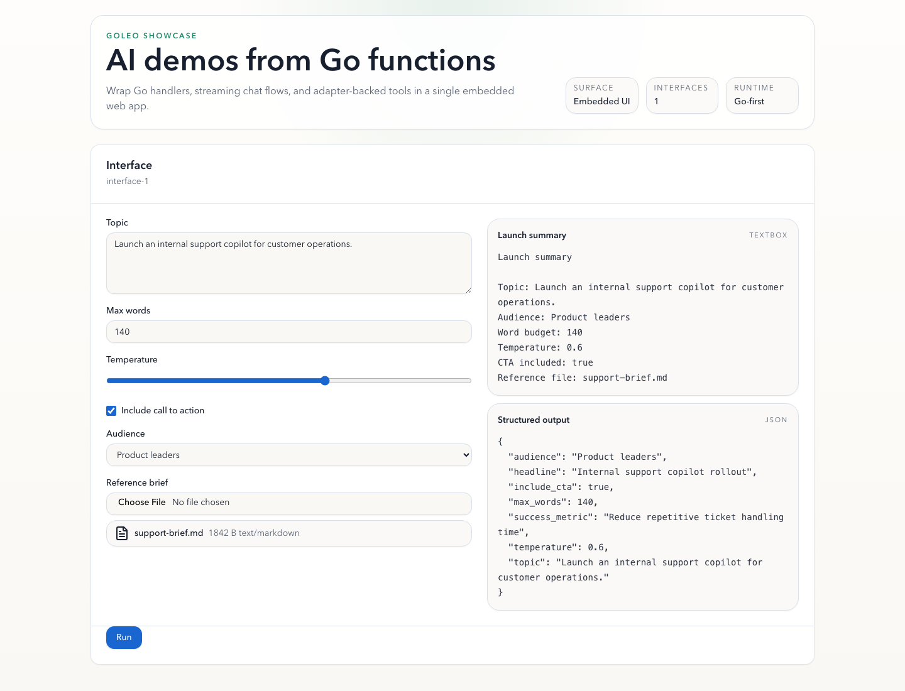
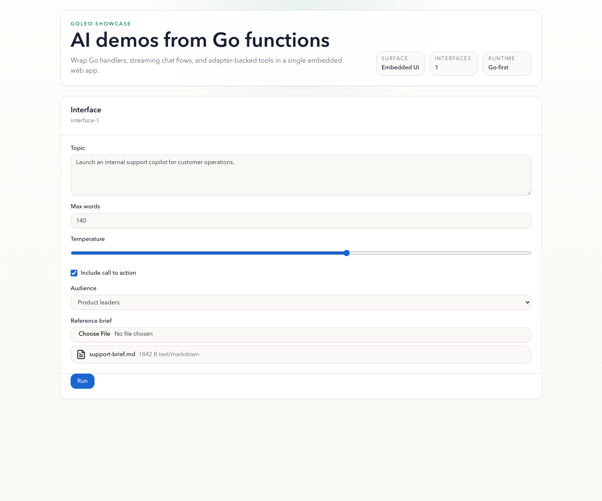
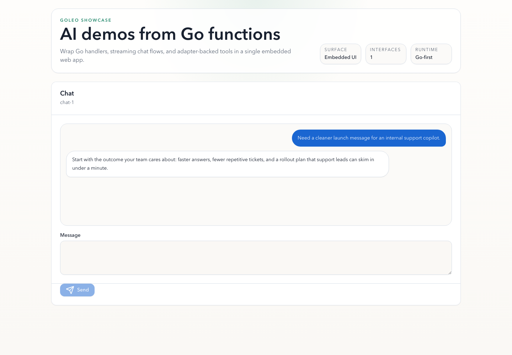
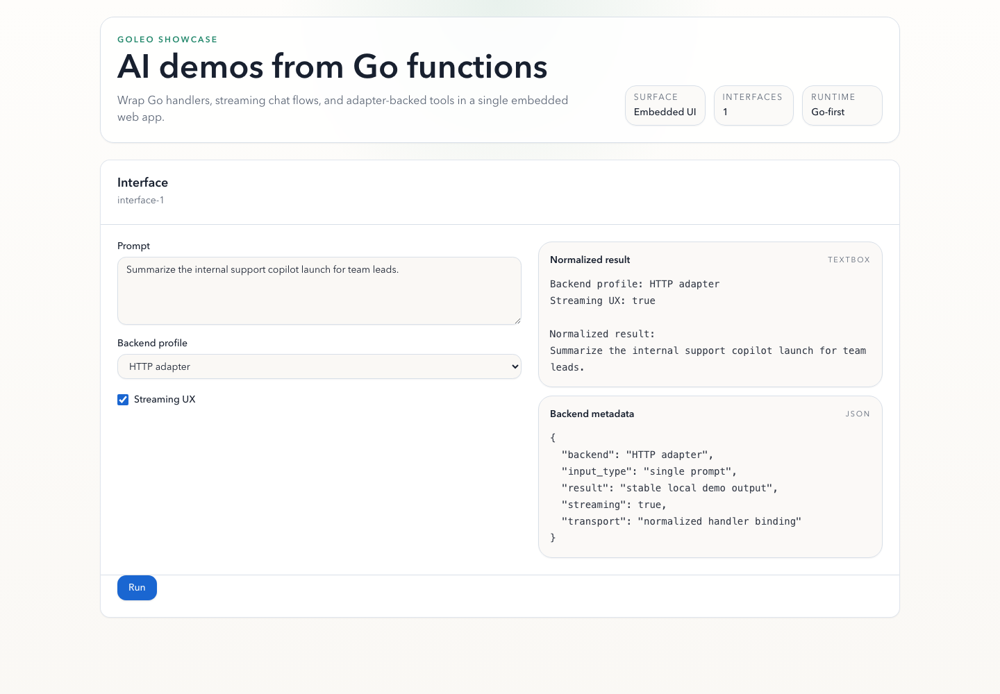
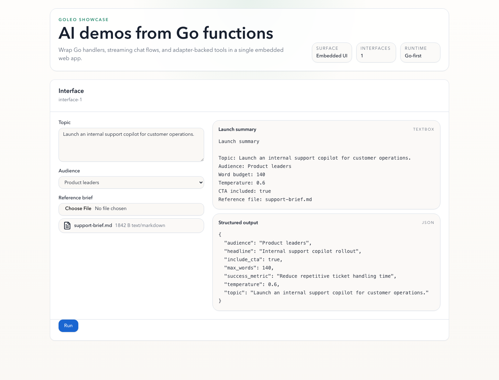

# Goleo: Build AI Demo Apps in Go

[](go.mod)
[](frontend)
[](#status)

[Usage](docs/usage.md) | [Components](docs/components.md) | [Architecture](docs/architecture.md) | [Examples](examples) | [Frontend](frontend)

Goleo turns Go functions, streaming handlers, HTTP endpoints, OpenAI-compatible
APIs, Ollama models, local processes, and full-duplex voice handlers into
embedded web apps.

Define inputs and outputs in Go, launch one binary, and get a usable local UI
with prediction, streaming, upload, asset playback, and voice session
endpoints. The built frontend is embedded into the Go binary, so there is no
separate frontend deployment step.



## What You Can Build

### Function-backed tools

Build richer local tools than a single textbox demo. The showcase form combines
typed inputs, file uploads, and multiple outputs in one surface.



### Streaming chat flows

Use `Chat` with a streaming handler to ship copilot-style demos and assistant
workflows without building the chat shell yourself.



### Adapter-backed interfaces

Wrap external backends behind the same UI contract. The same surface can front a
native Go handler, an HTTP API, an OpenAI-compatible endpoint, Ollama, or a
local process.



## Built-In Components

The embedded UI supports typed form controls and structured outputs out of the
box.

Built-in constructors include `Textbox`, `Number`, `Slider`, `Checkbox`,
`Dropdown`, `Button`, `Markdown`, `JSON`, `Image`, `Audio`, `File`, `State`,
`Row`, `Column`, `Group`, and `Chatbot`.

You can also use `CustomComponent` when you need to introduce a schema type
before a first-class constructor exists.

<p>
  
  
</p>

## Audio and Voice

Use `Interface` with `Audio(...)` when you want a normal request/response flow
with upload or microphone capture. The handler receives a `goleo.AudioInput`
with metadata plus a temporary `Path`. If the handler returns a
`goleo.AudioOutput`, Goleo stores it and serves it back through
`/api/assets/{id}` for browser playback.

```go
app.Interface(
 goleo.Handler(func(clip goleo.AudioInput) (string, goleo.AudioOutput, error) {
  return "received " + clip.Name, goleo.AudioOutput{
   Name:        "reply.wav",
   ContentType: clip.ContentType,
   Path:        clip.Path,
  }, nil
 }),
 goleo.Inputs(goleo.Audio("Prompt audio")),
 goleo.Outputs(goleo.Textbox("Summary"), goleo.Audio("Reply audio")),
)
```

To keep richer demo behavior visible:

- tune throughput with `app.ConfigureQueue(maxConcurrency, maxQueue)`;
- cancel stream runs with `POST /api/cancel` and returned `request_id`;
- carry session values in `goleo.State(...)`.

Use `Voice` when you need a live session over WebSocket with microphone chunks,
interrupts, and mixed text/audio output events. The browser connects to
`/api/voice/{id}/ws`; your handler works with `session.Receive()`,
`session.Send(...)`, and `session.SendAudio(...)`.

```go
app.Voice(goleo.VoiceHandler(func(session *goleo.VoiceSession) error {
 for {
  event, err := session.Receive()
  if err != nil {
   return err
  }

  switch event.Type {
  case "session.start":
   if err := session.Send(goleo.VoiceEvent{Type: "session.ready"}); err != nil {
    return err
   }
  case "input.stop":
   if err := session.Send(goleo.VoiceEvent{Type: "output.text", Text: "turn complete"}); err != nil {
    return err
   }
  case "session.close":
   return session.Send(goleo.VoiceEvent{Type: "session.closed"})
  }
 }
}))
```

Choose the surface based on the interaction model:

- `Interface + Audio`: turn-based upload or one-shot microphone capture.
- `Voice`: long-lived duplex session with chunked mic input and interrupt.

## Installation

Prerequisite: Goleo requires Go 1.24 or higher.

```sh
go get github.com/sneiko/goleo
```

For local development of this repository:

```sh
make check
```

> [!TIP]
> `make run-*` targets bind to `:7871` by default. Override the port when it is
> already in use, for example `GOLEO_ADDR=:7872 make run-chat`.

## Building Your First Demo

Create a Goleo app around any Go function:

```go
package main

import (
 "context"
 "log/slog"
 "os"
 "os/signal"
 "syscall"

 "github.com/sneiko/goleo"
)

func main() {
 logger := slog.New(slog.NewJSONHandler(os.Stdout, nil))
 app := goleo.New(goleo.WithLogger(logger))

 app.Interface(
  goleo.Handler(func(input string) (string, error) {
   return "Hello " + input, nil
  }),
  goleo.Inputs(goleo.Textbox("Prompt")),
  goleo.Outputs(goleo.Textbox("Result")),
 )

 ctx, stop := signal.NotifyContext(context.Background(), os.Interrupt, syscall.SIGTERM)
 defer stop()

 if err := app.LaunchContext(ctx, goleo.LaunchOptions{Addr: ":7860"}); err != nil {
  logger.Error("goleo server stopped", "error", err)
  os.Exit(1)
 }
}
```

Run the bundled minimal example:

```sh
make run-simple
```

Open `http://localhost:7871` after the server starts.

If you run examples directly with `go run`, they use `:7860` unless
`GOLEO_ADDR` is set.

## Showcase Examples

Use the richer examples when you want a more realistic surface than the minimal
hello-world demo.

| Command | Example | What it shows |
| --- | --- | --- |
| `make run-audio` | [`examples/audio`](examples/audio) | Turn-based audio upload or mic capture with text, JSON, and playback outputs |
| `make run-showcase-form` | [`examples/showcase-form`](examples/showcase-form) | Typed form inputs, file upload, text output, and structured JSON |
| `make run-showcase-chat` | [`examples/showcase-chat`](examples/showcase-chat) | Streaming chat transcript with a copilot-style response |
| `make run-showcase-adapters` | [`examples/showcase-adapters`](examples/showcase-adapters) | Adapter-oriented prompt flow with backend metadata |
| `make run-voice` | [`examples/voice`](examples/voice) | Full-duplex voice session with mic chunks, interrupt, and reply audio |
| `make run-blocks` | [`examples/blocks`](examples/blocks) | Blocks interface with click/change/load events, state, and runtime updates |

## More Examples

The repository keeps the focused integration demos as separate entry points.

| Command | Example | Notes |
| --- | --- | --- |
| `make run-simple` | [`examples/simple`](examples/simple) | Minimal function-backed form |
| `make run-chat` | [`examples/chat`](examples/chat) | Basic streaming chat surface |
| `make run-audio` | [`examples/audio`](examples/audio) | First-class `Audio` component with app-served playback assets |
| `make run-blocks` | [`examples/blocks`](examples/blocks) | Event-driven Blocks interface with state, load events, and update envelopes |
| `make run-voice` | [`examples/voice`](examples/voice) | WebSocket voice runtime with `VoiceHandler` |
| `make run-http` | [`examples/http-wrapper`](examples/http-wrapper) | Wrap an HTTP endpoint |
| `OLLAMA_MODEL=llama3.2 make run-ollama` | [`examples/ollama`](examples/ollama) | Stream from Ollama |
| `OPENAI_BASE_URL=http://localhost:11434/v1 OPENAI_MODEL=llama3.2 make run-openai-stream` | [`examples/openai-stream`](examples/openai-stream) | Stream from any OpenAI-compatible API |

## Chat and Streaming

Use `Chat` with a streaming handler for chat-style demos:

```go
app.Chat(goleo.StreamHandler(func(input string, emit goleo.EmitFunc) error {
 emit("You said: " + input)
 return nil
}))
```

Run the bundled chat demo:

```sh
make run-chat
```

## Voice Sessions

Use `Voice` for true duplex audio sessions where the browser streams microphone
chunks to your handler and the handler emits back text, state, and audio
events.

Browser -> server events in v1:

- `session.start`
- `input.audio`
- `input.stop`
- `output.interrupt`
- `session.close`

Server -> browser events in v1:

- `session.ready`
- `output.text`
- `output.audio`
- `output.state`
- `error`
- `session.closed`

Run the bundled duplex demo:

```sh
make run-voice
```

## Wrapping APIs and Processes

Goleo adapters return regular handler bindings, so you can swap native Go
functions for external systems without changing the UI definition.

Wrap an HTTP endpoint:

```go
app.Interface(
 goleo.HTTPAdapter(goleo.HTTPAdapterOptions{URL: "http://localhost:9000/predict"}),
 goleo.Inputs(goleo.Textbox("Prompt")),
 goleo.Outputs(goleo.Textbox("Result")),
)
```

Wrap an OpenAI-compatible streaming API:

```go
app.Chat(goleo.OpenAICompatibleStreamAdapter(goleo.OpenAICompatibleOptions{
 BaseURL: "http://localhost:11434/v1",
 APIKey:  os.Getenv("OPENAI_API_KEY"),
 Model:   "llama3.2",
}))
```

## Server Lifecycle

Configure HTTP server timeouts when needed:

```go
app.Launch(goleo.LaunchOptions{
 Addr:              ":7860",
 ReadHeaderTimeout: 5 * time.Second,
 ReadTimeout:       30 * time.Second,
 WriteTimeout:      0, // keep unset for long-lived streaming responses
 IdleTimeout:       60 * time.Second,
 ShutdownTimeout:   5 * time.Second,
})
```

For graceful shutdown, cancel the context passed to `LaunchContext`:

```go
ctx, stop := signal.NotifyContext(context.Background(), os.Interrupt, syscall.SIGTERM)
defer stop()

err := app.LaunchContext(ctx, goleo.LaunchOptions{Addr: ":7860"})
```

For advanced lifecycle control, build the server yourself:

```go
srv := app.Server(goleo.LaunchOptions{Addr: ":7860"})
err := srv.ListenAndServe()
```

## Logging and API Errors

Goleo uses `log/slog` for structured logs. Logging is opt-in: if you do not
pass a logger, Goleo stays quiet.

```go
logger := slog.New(slog.NewJSONHandler(os.Stdout, nil))
app := goleo.New(goleo.WithLogger(logger))
```

The built-in server logs request completion events with method, path, status,
duration, and `request_id`. If a request includes `X-Request-ID`, Goleo keeps
it; otherwise it generates one and returns it in the response header.

API errors use a structured JSON shape:

```json
{
  "error": {
    "code": "bad_request",
    "message": "interface_id is required"
  }
}
```

## Frontend Development

Goleo stays Go-first: built frontend assets are committed under `server/assets`,
so users can run examples without installing Node.js.

The embedded UI itself lives in `frontend` as a React/Vite/shadcn app:

```sh
make frontend-install
make frontend-dev
make frontend-test
make frontend-build
```

`make frontend-build` writes the static assets consumed by Go's `go:embed`.

Maintainers can regenerate the README screenshots with:

```sh
make readme-assets
```

## Status

This is an MVP implementation focused on Gradio-style local AI demos:

- `Interface` for function-backed forms
- `Chat` for streaming chat demos
- `Voice` for WebSocket duplex sessions
- `Audio` for upload and microphone-driven media inputs/outputs
- Embedded frontend assets served by the Go binary
- JSON prediction endpoint, SSE streaming endpoint, upload endpoint, asset
  endpoint, and voice WebSocket endpoint
- Native Go, HTTP, OpenAI-compatible, Ollama, streaming, and process adapters
- Optional structured logging with request IDs

Production platform features such as auth, persistent storage, hosting, queues,
and multi-user state are intentionally out of scope for v1.

## Architecture

The root `goleo` package is a facade over focused packages:

- `component`: component schema and constructors
- `core`: app model and schema generation
- `media`: handler-facing audio types and browser-safe asset descriptors
- `runtime`: handler binding and streaming abstraction
- `server`: HTTP routes, uploads, assets, SSE, voice sessions, embedded frontend
- `adapter`: HTTP, OpenAI-compatible, Ollama, and process adapters

See [docs/architecture.md](docs/architecture.md) for extension points.
